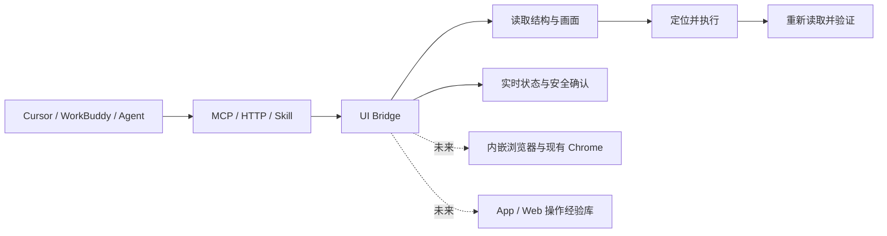

# UI Bridge

让 Cursor、WorkBuddy 和其他智能助手通过一个本机入口，可靠地读取和操作桌面界面。

UI Bridge 不把“发出一次点击”当作完成。它优先理解窗口和控件，在必要时结合画面，
执行后重新读取界面确认结果，并把正在操作的应用、来源和安全状态实时展示给用户。

> 当前可用版本支持 macOS 14.4 及以上。Windows、内嵌浏览器和跨 App/Web 操作经验库
> 已进入路线图，尚未包含在当前版本中。

## 为什么需要 UI Bridge

常见的桌面自动化只能反复截图、猜坐标，并占用用户的鼠标和键盘。UI Bridge 提供一个
更稳定的中间层：Agent 面向应用、窗口和控件提出意图，Bridge 负责选择合适的读取与
操作方式、处理系统权限、显示实时反馈，并验证界面是否真的发生了预期变化。

## 当前能力

- 发现正在运行的应用和窗口，读取 macOS 辅助功能结构。
- 获取单个窗口画面，并把控件位置与画面统一到同一坐标系。
- 点击、选择、文本写入、按键、滚动和窗口内操作。
- 每次写操作后重新读取并验证结果，拒绝过期快照。
- 通过本地 MCP、HTTP 和配套 Skill 接入 Cursor、WorkBuddy 等客户端。
- 在设置窗口中查看权限、连接、客户端到应用的映射、实时画面和诊断信息。
- 在菜单栏、目标窗口和动作位置提供可见操控反馈，同时尽量不抢前台。
- 对发送、删除、购买和权限变更等操作进行二次确认。
- 默认遮盖敏感字段，服务只监听本机。

## 工作方式



## 快速开始

从源码构建并安装：

```bash
swift build
./scripts/build-app.sh
./scripts/install-app.sh
```

安装完成后打开 `/Applications/UI Bridge.app`，按提示授予辅助功能和屏幕录制权限。
在菜单栏选择“复制 MCP 连接配置”，即可把本机服务接入支持 MCP 的客户端。

开发自检：

```bash
swift run protocol-self-test
swift run core-self-test
python3 skills/macos-ui-control/scripts/self_test.py
```

更完整的安装、命令、接口和客户端配置见
[本地开发、安装与接入](docs/development-and-operations.md)。

## 安全边界

- 服务只监听本机回环地址，除健康检查外均要求本机凭据。
- 密码类控件不返回明文，疑似敏感内容默认遮盖。
- 网页内容和应用内容不能自行扩大 Bridge 权限。
- 后台操作失败不会静默切换到前台。
- 发送、删除、购买、权限变更等高影响动作必须由用户确认。
- 系统调用成功不代表任务成功，结果必须从新界面状态得到证明。

## 路线图

- 内嵌 Chromium 浏览器和现有 Chrome 连接。
- 与 Codex 一致的 Chrome 用户、密码和 Cookie 本地导入体验。
- 自动沉淀、验证、更新和淘汰原生 App、网页共用的操作经验。
- Windows 原生应用支持。
- 正式签名、公证、安装包、自动更新和公开发布渠道。

详细规划见 [Web Bridge 计划](docs/05-future-web-plan.md) 和
[操作经验库计划](docs/06-experience-library-plan.md)。当前完成情况见
[项目状态](docs/04-current-status.md)。

## 文档

| 文档 | 内容 |
| --- | --- |
| [产品与架构](docs/01-product-and-architecture.md) | 当前产品边界、原则和 macOS 架构 |
| [协议与接入](docs/02-protocol-and-integrations.md) | MCP、HTTP、Skill 和客户端接入 |
| [交付与验证](docs/03-delivery-and-validation.md) | 测试策略、验收场景和质量门槛 |
| [当前状态](docs/04-current-status.md) | 已完成、未完成和当前限制 |
| [Web Bridge 计划](docs/05-future-web-plan.md) | 内嵌浏览器、Chrome 连接与资料导入 |
| [操作经验库计划](docs/06-experience-library-plan.md) | App 与 Web 共用的自动学习、复用和失效机制 |
| [本地开发与使用](docs/development-and-operations.md) | 构建、安装、命令、接口和排错 |
