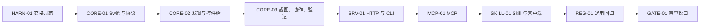

# Visual Map / 可视化图谱

Visual Map Contract: v1.0

## 阶段关系

## 阶段表

| Phase ID | Kind | Depends On | State | Completion | Output | Required Evidence | Exit Command | Actor | Evidence Status | Blocking Risk | Owner / Handoff |
| --- | --- | --- | --- | ---: | --- | --- | --- | --- | --- | --- | --- |
| HARN-01 | init | none | done | 100 | Harness、任务合同、交接规范 | harness check、commit | `harness task-start 2026-07-10-macos-ui-bridge-96db7c45` | agent | present | none | coordinator |
| CORE-01 | execution | HARN-01 | planned | 0 | Swift 包、协议模型、基础测试 | swift build/test | `harness task-phase 2026-07-10-macos-ui-bridge-96db7c45 CORE-01 --state done --completion 100 --evidence present` | agent | missing | toolchain compatibility | next agent reads progress |
| CORE-02 | execution | CORE-01 | planned | 0 | 通用应用/窗口/控件树 | unit + local read smoke | `harness task-phase 2026-07-10-macos-ui-bridge-96db7c45 CORE-02 --state done --completion 100 --evidence present` | agent | missing | AX variation | commit-backed handoff |
| CORE-03 | execution | CORE-02 | planned | 0 | 截图、动作和验证 | unit + test app | `harness task-phase 2026-07-10-macos-ui-bridge-96db7c45 CORE-03 --state done --completion 100 --evidence present` | agent | missing | permissions | commit-backed handoff |
| SRV-01 | execution | CORE-03 | planned | 0 | HTTP、鉴权、CLI | HTTP smoke | `harness task-phase 2026-07-10-macos-ui-bridge-96db7c45 SRV-01 --state done --completion 100 --evidence present` | agent | missing | lifecycle | commit-backed handoff |
| MCP-01 | execution | SRV-01 | planned | 0 | stdio 与 Streamable HTTP MCP | MCP smoke | `harness task-phase 2026-07-10-macos-ui-bridge-96db7c45 MCP-01 --state done --completion 100 --evidence present` | agent | missing | SDK integration | commit-backed handoff |
| SKILL-01 | execution | MCP-01 | planned | 0 | 通用 Skill 与客户端配置 | validator + scenarios | `harness task-phase 2026-07-10-macos-ui-bridge-96db7c45 SKILL-01 --state done --completion 100 --evidence present` | agent | missing | WorkBuddy capability | commit-backed handoff |
| REG-01 | execution | SKILL-01 | planned | 0 | 四类应用回归 | live evidence | `harness task-phase 2026-07-10-macos-ui-bridge-96db7c45 REG-01 --state done --completion 100 --evidence present` | agent | missing | app permissions | commit-backed handoff |
| GATE-01 | gate | REG-01 | planned | 0 | Agent Review Submission | review、walkthrough、lessons | `harness task-review 2026-07-10-macos-ui-bridge-96db7c45 --message "first-round ready"` | agent | missing | no open P0/P1 | coordinator |

允许的 `State`：`planned`, `in_progress`, `review`, `blocked`, `done`, `skipped`。
