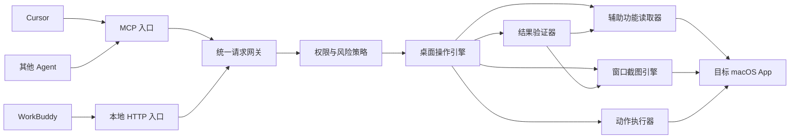

# App MCP Bridge：macOS 产品与架构设计

状态：macOS 第一版开发中

产品名称为 `App MCP Bridge`，不把平台写进产品名，为后续增加 Windows 实现保留空间。
当前安装包仍只支持 macOS；内部的 `macos-ui-bridge` 连接名和程序身份作为兼容标识保留，
避免现有客户端配置与系统权限失效。

## 1. 目标

构建一个常驻本机、第一轮无产品界面的 macOS 服务 App，让 Cursor、WorkBuddy、Codex、Claude Code
等智能助手通过统一接口读取和操作桌面应用。

产品首先解决三个问题：

1. 尽可能完整地读取应用内部结构，而不是只看截图猜坐标。
2. 优先按控件执行操作，只有控件不可用时才使用窗口内坐标。
3. 默认不抢前台；确实需要前台、发送、删除或提交时，提供明确的升级和确认信息。

第一版交付通用核心，不针对某个应用写死规则。TextEdit、Finder、企业微信和
典型 Electron 应用只作为四类代表样本，用来验证同一套读取、定位、输入和验证
能力。未通过样本测试的能力不得宣称为通用。

## 2. 范围

### 第一版包含

- macOS 14.4 及以上。
- 列出应用、进程、窗口和窗口位置。
- 按指定窗口截图，不截整个桌面。
- 读取完整的 macOS 辅助功能树。
- 将窗口截图与控件位置统一到同一坐标系。
- 为每次读取生成稳定的快照和控件句柄。
- 点击、选择、设置文本、输入文本、按键、滚动和执行控件公开动作。
- 后台优先、前台升级、操作后验证。
- 本地 MCP 接口和本地 HTTP 接口。
- Cursor 与 WorkBuddy 的接入示例和配套 Skill。
- 可安装到 Cursor/WorkBuddy 的第一版通用 Skill。
- 基础令牌鉴权、敏感字段遮盖、动作记录和紧急停止。

### 第一版不包含

- Windows 和 Linux。
- 远程控制另一台电脑。
- 云端账户、团队后台或多租户管理。
- 绕过验证码、安全警告、系统权限或应用自身限制。
- 基于大模型的通用视觉识别服务。
- 为每个应用编写大量固定坐标脚本。
- 自动执行付款、删除、改密码等高风险最终动作。
- 产品设置页、菜单栏面板和可视化调试界面。
- 自动更新、正式发布渠道和团队管理。

### 可见操控反馈

桌面操作不能在用户无感知的情况下发生。Bridge App 为所有接入方式提供同一套
本机可见反馈，不依赖 Cursor 或 WorkBuddy 自己实现界面：

- 当当前最前方窗口正在被读取或操作时，在窗口内容左上角显示紫色“操作中”胶囊；
  后台窗口只进入菜单记录，禁止把提示画到当前应用上。提示窗口不获取焦点、不接收
  鼠标事件，也不改变目标窗口层级。
- 菜单栏列出最近仍处于操控会话中的目标应用；同一应用的连续步骤合并为一项，
  最后一次活动后保留 90 秒再自动移除，给客户端生成回答和用户打开菜单留出时间。
- 执行动作时，在目标控件中心或坐标位置显示大范围模拟指针。中心清晰，外缘使用
  透明渐变，整体不接收鼠标事件；坐标必须来自当前快照。
- 操控状态通过本机进程间通知传递，使 App 内 HTTP 与客户端直接启动入口产生一致
  反馈。通知只包含应用名、进程号、窗口范围和指针位置，不包含界面正文。

## 3. 产品原则

### 按动作选择能力

不把某个应用整体判定为“可后台”或“必须前台”。同一个任务中，搜索框可以
后台填写，列表可能需要按控件选择，最终发送又需要单独确认。每一步重新选择
最合适的方式。

### 结构和画面必须交叉检查

只看控件树会漏掉自绘内容，只看截图会依赖不稳定坐标。每个快照同时返回控件
结构、窗口截图、窗口尺寸和缩放信息。画面明显有列表而结构只有空表格时，必须
标记为“结构不完整”。

### 工具返回值不是最终真相

点击事件成功投递不等于界面发生变化；文字写入辅助层也不等于应用业务逻辑已
响应。每个有意义的动作之后都重新读取状态，并按预期变化验证。

### 默认局部权限

服务只监听本机回环地址；默认只允许用户明确授权的应用；截图只保留在内存或
短期临时目录；任何客户端都不能自行扩大权限。

## 4. 推荐技术选择

| 部分 | 推荐选择 | 原因 |
|---|---|---|
| App | Swift 6 无界面 App Bundle（LSUIElement） | 保持稳定权限身份，通过端口提供服务，不开发产品界面 |
| 最低系统 | macOS 14.4 | 与当前 Computer Use 本机要求对齐，减少旧系统兼容成本 |
| 并发 | Swift Concurrency + actor | 串行保护每个应用的快照和操作状态 |
| 控件读取 | AXUIElement、AXObserver | 获取层级、属性、动作和变化通知 |
| 窗口发现 | NSWorkspace、CGWindowList、ScreenCaptureKit | 关联进程、窗口和可捕获内容 |
| 截图 | ScreenCaptureKit | 精确截取单个窗口并处理缩放 |
| 控件操作 | AXUIElementPerformAction、AXUIElementSetAttributeValue | 优先无鼠标的语义操作 |
| 输入补充 | CGEventPostToPid | 控件不支持直接写入时向目标进程投递输入 |
| 本地服务 | SwiftNIO 或 Hummingbird | 提供本地 HTTP、流式响应和 WebSocket/事件能力 |
| MCP | 官方 MCP Swift SDK | 当前已支持服务端、stdio 和 Streamable HTTP，可减少跨语言进程 |
| 数据格式 | JSON Schema | Cursor、WorkBuddy 和测试工具共享契约 |
| 日志 | os.Logger + 本地结构化审计文件 | 便于诊断且不默认记录正文 |

不建议用 Electron 开发主 App。Electron 可以快速做界面，但无法降低原生辅助
功能、窗口捕获、签名、权限和输入投递的复杂度，反而增加常驻资源占用。

## 5. 总体架构

## 6. 进程设计

### macOS 无界面服务 App

第一轮作为无 Dock 图标、无菜单栏面板的 App Bundle 常驻，负责：

- 检查并通过端口报告权限状态；首次授权依赖 macOS 系统提示与系统设置。
- 基础客户端令牌和应用访问限制。
- 辅助功能读取、窗口截图和动作执行。
- 本地端口、会话和紧急停止。
- 诊断包导出。

服务 App 必须是唯一持有辅助功能与屏幕录制权限的进程，避免 Cursor、WorkBuddy
和不同 MCP 客户端分别申请系统权限。

第一轮可提供 `start`、`stop`、`status`、`permissions`、`token` 和 `doctor`
命令作为管理入口。需要用户处理权限时，命令输出准确的系统设置位置和当前状态，
不为此开发自定义界面。

### MCP 入口

推荐同时支持：

- `stdio`：由 Cursor 直接启动 `macos-ui-bridge mcp`。
- Streamable HTTP：连接已经运行的 App，地址为
  `http://127.0.0.1:8765/mcp`。

命令行入口只是与服务 App 通信的轻量客户端，不直接操作系统界面。这样升级 MCP
适配器不会影响系统权限归属。

### 本地 HTTP 入口

用于 WorkBuddy 或不支持 MCP 的客户端：

- `GET /health`
- `GET /v1/apps`
- `GET /v1/apps/{pid}/windows`
- `POST /v1/snapshots`
- `POST /v1/actions`
- `GET /v1/actions/{id}`
- `POST /v1/actions/{id}/confirm`
- `POST /v1/emergency-stop`

只监听 `127.0.0.1` 和 `::1`，禁止默认监听局域网地址。

## 7. 核心模块

### AppRegistry

合并 `NSWorkspace`、运行进程与窗口信息，生成稳定的应用标识：

- bundle identifier
- pid
- 显示名称
- 可执行文件路径
- 是否运行
- 是否前台
- 权限状态

进程重启后 pid 会变化，客户端必须优先用 bundle identifier 定位，再使用当前
pid 执行动作。

### WindowRegistry

将辅助功能窗口、Core Graphics 窗口和 ScreenCaptureKit 窗口关联起来。关联顺序：

1. pid 与窗口编号精确匹配。
2. pid、标题和边界匹配。
3. pid、边界交集和层级匹配。
4. 无法唯一确定时返回候选，禁止猜测主窗口。

### AXTreeReader

递归读取：

- role、subrole、title、description、value、help、identifier
- enabled、focused、selected、expanded、settable
- position、size、visible children、selected children
- available actions
- parent/children/rows/cells/contents 等关系

企业微信的关键在于不能只读取普通 `AXChildren`。读取器需要按控件类型尝试
`AXRows`、`AXVisibleRows`、`AXContents`、`AXVisibleChildren`、
`AXSelectedChildren` 等关系，并对虚拟列表进行有限展开。

读取必须有边界：

- 默认最多 2,000 个节点。
- 默认最大深度 30。
- 单次应用消息超时 1 秒，可配置到 5 秒。
- 单个属性失败不应丢弃整个节点。
- 循环引用去重。
- 对不可见的海量历史消息只返回当前可见区域与摘要。

窗口快照必须从与 `window_id` 边界最匹配的 `AXWindow` 开始遍历，不能从应用根节点
读取后混入同一进程的其他窗口。辅助功能返回的屏幕坐标在进入快照时统一减去目标
窗口原点，保证 `frameInWindow` 始终是窗口内坐标。

### SnapshotStore

每次读取产生：

- `snapshot_id`
- `app_id`、`pid`、`window_id`
- 窗口边界
- 截图宽高与缩放换算
- 扁平化节点数组
- 父子关系
- 截图句柄
- 创建时间与过期时间

控件句柄格式建议为：

`{snapshot_id}:{node_index}:{fingerprint}`

其中 fingerprint 由 role、identifier、可访问路径和局部属性生成。动作执行前验证
快照仍属于当前进程和窗口；过期或窗口变化时返回 `stale_snapshot`，不静默使用
旧坐标。

### CaptureEngine

使用 ScreenCaptureKit 获取单个窗口画面。输出同时包含像素尺寸和窗口逻辑尺寸，
坐标转换只在服务内部完成。客户端看到的坐标始终是截图像素坐标。

必须处理：

- Retina 缩放。
- 窗口阴影和标题栏偏移。
- 窗口缩放、最大化和跨屏移动。
- 窗口被遮挡或位于其他空间。
- 受保护内容产生黑屏。

### ActionExecutor

动作梯度：

1. 对明确控件执行辅助功能动作。
2. 对可写控件直接设置值。
3. 聚焦目标控件后向指定 pid 投递键盘事件。
4. 使用窗口内像素投递后台点击。
5. 经客户端确认后短暂前置窗口执行，并恢复原前台应用。

禁止在一个动作中自动跨越第 4 步到第 5 步。需要前台时返回可解释的
`foreground_required`，由客户端向用户确认。

### VerificationEngine

动作请求可以携带预期条件：

- 节点值等于或包含某段文字。
- 某个节点出现、消失、选中或聚焦。
- 窗口标题变化。
- 截图指定区域发生足够变化。
- 搜索结果中出现目标名称。

服务重新读取快照后判断：

- `confirmed`
- `not_observed`
- `ambiguous`
- `failed`

不能因为系统调用返回成功就直接报告 `confirmed`。

### PolicyEngine

策略只判断本地执行条件，不替代 Agent 自身的安全规则。至少区分：

- 只读。
- 可逆本地操作。
- 可能抢前台。
- 向第三方发送或提交。
- 删除、购买、权限和系统设置。

服务在高影响动作前签发一次性确认令牌，令牌绑定客户端、动作内容、目标应用、
目标窗口和过期时间，不能被另一动作复用。

## 8. 通用能力与应用兼容策略

核心引擎禁止依赖应用名称、联系人名称或固定坐标。应用差异只能通过能力探测、
标准角色、公开动作、结构质量和验证结果表达。需要特殊兼容时，必须先证明它可
抽象为某类控件或框架行为；无法抽象的适配放入独立兼容层，不能污染通用核心。

### 原生 AppKit 应用

优先完整语义操作，目标是大部分任务不切前台。

### Chromium 和 Electron

区分原生壳和网页内容。读取 `AXWebArea` 下的可见节点；对可写节点设置值后必须
检查渲染层是否真正响应。浏览器页面优先交给 CDP，桌面桥只处理浏览器外壳。

### Qt、企业微信和虚拟列表

重点读取 rows、visible rows、cells 和 contents；按行选择，而不是点击截图坐标。
如果应用只暴露外层表格，返回 `partial_tree`，交给备用视觉路线或前台升级，禁止
伪装成完整结果。

### 自绘、Canvas、WebGL 和普通微信

第一版不承诺完整语义读取。使用截图定位时必须限制在目标窗口，并要求操作后
验证。若后台事件被丢弃，返回前台升级请求。

## 9. 权限和签名

App 需要：

- 辅助功能权限：读取和操作其他应用控件。
- 屏幕录制权限：截取窗口画面。
- 必要时的输入监控权限需单独评估，第一版尽量避免。

必须使用稳定 bundle identifier 和开发者签名。开发调试与发布版本的身份不能
频繁变化，否则用户需要反复授权。

推荐 bundle identifier：`com.juln.macos-ui-bridge`。

## 10. 关键风险

| 风险 | 对策 |
|---|---|
| 不同应用暴露的控件差异极大 | 用能力探测而非应用类型硬编码 |
| 企业微信等虚拟列表读取不全 | 多关系遍历、可见节点优先、真实应用回归测试 |
| 后台事件被应用丢弃 | 明确升级，不盲目重试 |
| 截图与窗口坐标错位 | 服务内统一换算，窗口变化后强制快照失效 |
| 应用卡住导致读取阻塞 | 每个属性超时、隔离队列和熔断 |
| 客户端滥用本地端口 | 回环监听、令牌、应用白名单、客户端配对 |
| 日志泄露聊天内容和密码 | 默认只记录元数据，敏感属性遮盖，诊断包需用户主动导出 |
| 高影响操作误执行 | 一次性确认令牌与紧急停止 |

## 11. 官方技术依据

- Apple AXUIElement：<https://developer.apple.com/documentation/applicationservices/axuielement_h>
- Apple ScreenCaptureKit：<https://developer.apple.com/documentation/screencapturekit>
- Apple CGEvent：<https://developer.apple.com/documentation/coregraphics/cgevent>
- MCP 规范：<https://modelcontextprotocol.io/specification/>
- MCP Swift SDK：<https://github.com/modelcontextprotocol/swift-sdk>
